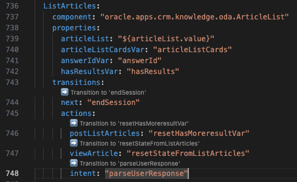
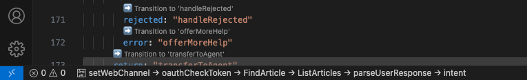
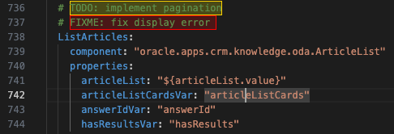

# 🧠  oda-dialog-code-visual-helper README

This VS Code extension streamlines the development of Oracle Digital Assistant (ODA) skills built using YAML.

In YAML code the flow of the conversation is basically an ordered list of state transitions.
Tracing these transitions manually can become tedious — especially in large files.

## ✨ What this extension does
- Adds clickable CodeLens links next to each transition and automatically scrolls to the target state when clicked

- Tracks visited states and shows them as a breadcrumb trail in the status bar and lets you quickly backtrack to previous states

- Highlights TODO and FIXME in the code

## Getting Started

You can find the YAML code in the skill conversation designer/dialog code.
You can edit that code inline in the ODA platform, but it is very slow (it is saved to the cloud after every change) and error phrone (there is no source control).
Therefore it is considered best practise to edit the code in a code editor like VSCode.
Install the extension.
Run command (cntrl + shift + p) `Follow transitions`

## Known Issues

### Visual Flow Designer
Skills built using the Visual Flow Designer do not use YAML code and as such do not need this extension.

## Release Notes

### 1.0.0

Initial release of extension.

**Enjoy!**
